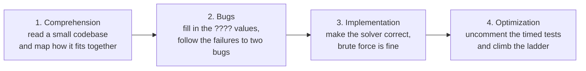

# AI Coding Interview Practice

*Ten timed problems for the AI-assisted coding interview, run in your own editor with your own agent.*

Amazon, Google, and a growing list of companies are moving to an interview format where an AI
assistant is allowed for the whole session. You get a small codebase with bugs, a solver to implement,
and timed tests that force you to optimize. The interviewer is not grading whether you can
write the algorithm from memory. They are grading how you drive the assistant.

This repo puts that setup in front of you locally, with whatever agent you already use:
Claude Code, Cursor, Codex, Copilot. One problem per folder, an answer key per problem, and
a prompt that turns your agent into the interviewer.

## The four phases



Every problem runs the same way the real interview does, in about 50 working minutes. The
domain class ships with two planted bugs. Some tests are commented out with `????` where
the expected value should be: fill those in, run them, and follow the failures. Then make
the correctness tests pass. Then uncomment the timed tests, which brute force will not
survive, and find the better algorithm, and then the one after that, because the last timed
test usually breaks the first optimization too.

## Quick start

1. Clone the repo.

   ```bash
   git clone https://github.com/azizu06/ai-coding-interview-practice
   cd ai-coding-interview-practice
   ```

2. Pick a problem from the table below and read its README, for example
   [`problems/01_word_container/README.md`](problems/01_word_container/README.md).

3. Start a 50 minute timer, open your coding agent in that folder, and run the demo and the
   tests from the repository root.

   ```bash
   python problems/01_word_container/src/main.py
   python -m unittest discover -s problems/01_word_container/src -v
   ```

4. When the timer stops, and not before, open the answer key:
   [`solutions/01_word_container/ANSWER_KEY.md`](solutions/01_word_container/ANSWER_KEY.md).
   Each one lists the two bugs, the optimization ladder with complexities, and examples of
   good and bad prompts for that problem.

5. To try a problem again from scratch, put its folder back the way it shipped.

   ```bash
   git checkout -- problems/01_word_container
   ```

## The problems

| # | Problem | Difficulty | Topics | Optimization ladder |
| --- | --- | --- | --- | --- |
| 01 | [Word Container](problems/01_word_container/) | Medium | Strings, sets, tries | pairs, substrings, trie |
| 02 | [Spell Checker](problems/02_spell_checker/) | Easy | Edit distance, indexing | scan, variants, index |
| 03 | [Inventory Packer](problems/03_inventory_packer/) | Easy | Greedy algorithms, bin packing | scan, buckets, bisect |
| 04 | [Task Scheduler](problems/04_task_scheduler/) | Medium | Graphs, topological order | rescan, Kahn, sweep |
| 05 | [Route Planner](problems/05_route_planner/) | Medium | Weighted graphs, Dijkstra | scan, heap, early exit |
| 06 | [Maze Solver](problems/06_maze_solver/) | Medium | Grid BFS, state search | revisit, states, waypoints |
| 07 | [Friend Recommender](problems/07_friend_recommender/) | Medium | Social graphs, counting, top k | scan, two hops, hoist |
| 08 | [Card Game](problems/08_card_game/) | Medium | Enumeration, precomputed tables | subsets, table, seven cards |
| 09 | [Log Analyzer](problems/09_log_analyzer/) | Medium-Hard | Sliding windows, percentiles | rescan, bisect, carry |
| 10 | [Rate Limiter](problems/10_rate_limiter/) | Hard | Sliding windows, token buckets | rescan, deque, running total |

## How a session works

<details>
<summary>The 50 minute clock, the commented-out tests, and what to do when you get stuck</summary>

<br>

**Set a real timer.** The problems are built to be slightly too much for the time, which is
the point. Finishing early means you picked one that is too easy for you.

**Run the demo first.** `python src/main.py` prints the domain class doing its job. On most
of these problems at least one planted bug is visible in that output if you read it.

**Uncomment one test at a time.** Every problem ships with some tests commented out and
some expected values written as `????`. Uncommenting the whole file at once buries you in
failures that all look alike. Take one, work out the value it should hold, and run it.

**Timed tests come last.** They live at the bottom of `src/test_solver.py` and they are
commented out for a reason: brute force is supposed to fail them. Get the correctness tests
green before you touch them.

**Until you implement the solver, `test_solver.py` fails.** That is the shipped state, not
a broken checkout. The domain tests pass as shipped.

**Do not open `solutions/` while the clock runs.** The answer key names both bugs in the
first paragraph.

</details>

## What gets graded

The evaluation an interviewer writes up, and what each line actually means:

| Criterion | What they are looking for |
| --- | --- |
| Code comprehension | Did you understand the codebase before you changed it |
| Debugging | Did you use the tests to find the bugs, and can you explain the fix |
| Implementation | Did you have a plan before you prompted, and did you verify the output |
| Optimization | Did you reason about complexity, and did you find the second rung of the ladder |
| AI usage | Too hesitant or too dependent, did you lead the model, did you catch its mistakes |
| Communication | Did the interviewer always know what you were doing and why |

<details>
<summary>What interviewers say separates a strong session from a weak one</summary>

<br>

These notes come from watching a former Meta staff engineer run a mock of this format and
from candidate reports.

- **Using the AI too little is the most common failure.** The interview is built to be too
  hard to finish by hand. If you ignore the assistant, they cannot evaluate how you work
  with one, and the candidate next to you is moving twice as fast.
- **Ask informed questions, not lazy ones.** "Implement the solver" and "find the bug" teach
  the interviewer nothing about you. "Add a one sentence comment to each function in
  word_list.py" or "give me a bulleted list of the key functions per class" speeds up
  comprehension and shows you are driving.
- **Say your plan out loud before you prompt.** A two sentence summary of the brute force,
  then ask the agent to write exactly that. Now the interviewer knows the idea was yours.
- **Do not narrate the generated code line by line.** Give a two or three sentence summary of
  what it does and confirm it matches what you expected.
- **Run tests one at a time.** Uncommenting everything at once buries you in failures.
- **Adding or tightening a test that you think is weak is a visible plus.**
- **Ask for complexity without leading.** "What is the time complexity if N is the number of
  words and M is the average length" instead of "is this N squared". Then check it against
  your own answer.
- **Clear the chat before asking for optimization options.** If the old brute force is in
  context the model will anchor on it and agree with you.
- **The assistant will confidently introduce bugs.** In the reference walkthrough the model
  added a substring check that counted a word as containing itself. A print statement caught
  it. Read what it writes.
- **Ask for a list of options, then pick.** "Give me a concise list of options to optimize
  this beyond brute force" surfaces the trie or heap or index you did not think of, and you
  still get credit for choosing.

</details>

## Run the interviewer prompt

Paste [INTERVIEWER_PROMPT.md](INTERVIEWER_PROMPT.md) into your coding agent, then name the
problem folder:

```
Use problems/05_route_planner. Start the clock.
```

The agent runs the session as the interviewer: it orients you, asks you to state your plan
before it writes code, refuses to just hand you the answer, calls the time every ten
minutes, and writes a scored evaluation at the end against the criteria in the table above.

## Verify the repo

Every problem is checked end to end by a script in the standard library only. It works in a
temporary copy, so it never touches your work in progress.

```bash
python tools/verify.py
python tools/verify.py 01_word_container 04_task_scheduler
```

It runs four stages per problem: the shipped tree passes its domain tests, the reference
solution passes everything once the `????` values are filled in, the reference solver clears
every timed budget with room to spare, and the brute force solver fails at least one timed
test on time. A full run takes a few minutes.

## Credit and license

The format is modeled on the AI coding practice at
[Hello Interview](https://www.hellointerview.com/practice/ai-coding) and Evan King's
[walkthrough video](https://www.youtube.com/watch?v=A1kX8fJx53c). All code and problem text
here is original. If you want the real thing, with an in-browser CoderPad clone and AI
grading, go use theirs.

Contributions are welcome: see [CONTRIBUTING.md](CONTRIBUTING.md).

Licensed under the MIT License. See [LICENSE](LICENSE).
