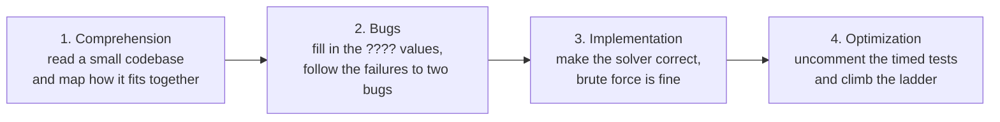

# AI Coding Interview Practice

*Ten timed problems for the AI-assisted coding interview, run in your own editor with your own agent.*

Amazon, Google, and a growing list of companies are moving to an interview format where an AI
assistant is allowed for the whole session. You get a small codebase with bugs, a solver to implement,
and timed tests that force you to optimize. The interviewer is not grading whether you can
write the algorithm from memory. They are grading how you drive the assistant.

This repo puts that setup in front of you locally, with whatever agent you already use:
Claude Code, Cursor, Codex, Copilot. One problem per folder, an answer key per problem, and
a prompt that turns your agent into the interviewer.

## The four phases



Every problem runs the same way the real interview does, in about 50 working minutes. The
domain class ships with two planted bugs. Some tests are commented out with `????` where
the expected value should be: fill those in, run them, and follow the failures. Then make
the correctness tests pass. Then uncomment the timed tests, which brute force will not
survive, and find the better algorithm, and then the one after that, because the last timed
test usually breaks the first optimization too.

## Quick start

1. Clone the repo.

   ```bash
   git clone https://github.com/azizu06/ai-coding-interview-practice
   cd ai-coding-interview-practice
   ```

2. Pick a problem from the table below and read its README, for example
   [`problems/01_word_container/README.md`](problems/01_word_container/README.md).

3. Start a 50 minute timer, open your coding agent in that folder, and run the demo and the
   tests from the repository root.

   ```bash
   python problems/01_word_container/src/main.py
   python -m unittest discover -s problems/01_word_container/src -v
   ```

   Or let [the session tools](#session-tools) handle the timer, the scratch copy, and the
   test commands: `python tools/session.py start 01`.

4. When the timer stops, and not before, open the answer key:
   [`solutions/01_word_container/ANSWER_KEY.md`](solutions/01_word_container/ANSWER_KEY.md).
   Each one lists the two bugs, the optimization ladder with complexities, and examples of
   good and bad prompts for that problem.

5. To try a problem again from scratch, put its folder back the way it shipped.

   ```bash
   git checkout -- problems/01_word_container
   ```

   A session started with `tools/session.py` works in `workspace/` instead, so there is
   nothing to restore: `python tools/session.py reset 01`.

## Two ways to practice

Both run on the same problems. Pick one before you start the clock, not halfway through.

**Practice mode: your own agent plus AGENTS.md.** Work the problem the way you work a
ticket, with the assistant beside you. [AGENTS.md](AGENTS.md) is the rule sheet it follows:
never open `solutions/`, never uncomment a timed test or fill in a `????` on its own, no
unsolicited hints, no volunteering the optimal algorithm, short answers, honest complexity.
Claude Code picks it up through [CLAUDE.md](CLAUDE.md), which is one line importing it.
Agents that read `AGENTS.md` find it themselves. Cursor and Copilot want you to point at the
file once at the top of the chat. When the clock stops, paste the block at the bottom of
[RUBRIC.md](RUBRIC.md) into that same chat and let it grade the session from the
conversation it just had with you.

**Interview mode: INTERVIEWER_PROMPT.md from minute zero.** Paste
[INTERVIEWER_PROMPT.md](INTERVIEWER_PROMPT.md) into a fresh chat before you read anything
else. The agent stops being your assistant and runs the session as the interviewer: it
orients you, makes you state a plan before it writes code, refuses to just hand over the
answer, calls the time every ten minutes, and writes the scored evaluation itself at 50
minutes. Harder, closer to the real room, and worth doing once practice mode stops
surprising you.

Practice mode grades you at the end. Interview mode grades you the whole way through.

## Session tools

Two scripts, standard library only, that do what the practice platform's clock and Run
dropdown do. Neither is required. A kitchen timer and `python -m unittest` still work.

`tools/session.py` copies the problem into `workspace/`, which is git ignored, so
`problems/` stays pristine and a second attempt is one `reset` away.

```bash
python tools/session.py start 03              # 50 minutes on 03_inventory_packer
python tools/session.py start 03 --minutes 25 # shorter
python tools/session.py start 03 --fresh      # throw away an earlier workspace copy
python tools/session.py status                # time remaining
python tools/session.py reset 03              # delete the workspace copy, after asking
```

It calls the time at every ten minute mark and again at five minutes left, then runs the
tests for you when the clock stops. A whole session, shortened to twelve minutes so it fits
on the page:

```
$ python tools/session.py start 04 --minutes 12
session: 04_task_scheduler, 12 minutes
working copy: workspace/04_task_scheduler
read this first: workspace/04_task_scheduler/README.md
log: workspace/04_task_scheduler/SESSION_LOG.md

Your agent starts in ASK MODE: it explains, proposes code in chat, and
answers complexity questions, but it does not edit files. You type. Say "edit mode" in
chat to let it edit files inside this problem folder, and "ask mode" to switch back.
The rules it follows are in AGENTS.md at the repository root.

run things with: python tools/run.py 04 main|domain|solver|timed
time calls at 7 min, 10 min
Ctrl-C ends the session early. The clock starts now.

[00:07:00 elapsed] 5 minutes left. Suggested phase: implementation.
[00:10:00 elapsed] 2 minutes left. Suggested phase: optimization.

time. the 12 minutes are up.

running the tests in the workspace copy, one moment

domain tests (test_task_graph): Ran 8 tests in 0.000s, OK
solver tests (test_solver): Ran 4 tests in 0.001s, FAILED (failures=2, errors=1)
elapsed 00:12:00, logged to workspace/04_task_scheduler/SESSION_LOG.md

paste RUBRIC.md into your agent chat to get graded
```

The default 50 minute session calls the time at 10, 20, 30, 40, and 45 minutes. Ctrl-C ends
it early and still runs the tests and writes the log.

Every call lands in `SESSION_LOG.md` next to the problem, so you can see afterwards where
the time actually went:

```markdown
# Session log: 04_task_scheduler

- started 2026-09-15 09:27:01
- budget 12 minutes
- time calls at 7 min, 10 min

## Time calls

- 2026-09-15 09:34:01  5 minutes left (7 elapsed), suggested phase: implementation
- 2026-09-15 09:37:01  2 minutes left (10 elapsed), suggested phase: optimization
- 2026-09-15 09:39:01  time, the 12 minutes are up

## Session end (clock ran out)

- 2026-09-15 09:39:01  elapsed 00:12:00
- domain tests (test_task_graph): Ran 8 tests in 0.000s, OK
- solver tests (test_solver): Ran 4 tests in 0.001s, FAILED (failures=2, errors=1)
```

`tools/run.py` is the Run dropdown. It runs against `workspace/<slug>` when a session copy
exists and against `problems/<slug>` when it does not.

```bash
python tools/run.py 03 main      # the demo, src/main.py
python tools/run.py 03 domain    # the domain unit tests
python tools/run.py 03 solver    # test_solver.py as it stands
python tools/run.py 03 timed     # reveal the next timed test, then run test_solver.py
python tools/run.py 03 all       # main, then domain, then solver
python tools/run.py 03 --list    # which timed tests are revealed, which are hidden
```

`timed` uncomments exactly one test, the next one down the ladder, and nothing else.
The second `$` line below is run.py echoing the command it ran, not something you type:

```
$ python tools/run.py 03 timed
03_inventory_packer  (workspace/03_inventory_packer, workspace copy)
revealed test_medium_2000_items in TestSolverSpeed (1 of 4 timed tests now revealed)
$ cd workspace/03_inventory_packer/src && python -m unittest -v test_solver
test_empty_inventory (test_solver.TestSolverCorrectness.test_empty_inventory) ... FAIL
...
test_medium_2000_items (test_solver.TestSolverSpeed.test_medium_2000_items) ... ERROR
```

```
$ python tools/run.py 03 --list
03_inventory_packer  (workspace/03_inventory_packer, workspace copy)
timed tests in TestSolverSpeed:
  [revealed] test_medium_2000_items
  [revealed] test_large_40000_items
  [hidden  ] test_huge_200000_items
  [hidden  ] test_wide_weights_20000_items
2 revealed, 2 hidden
```

## The problems

| # | Problem | Difficulty | Topics | Optimization ladder |
| --- | --- | --- | --- | --- |
| 01 | [Word Container](problems/01_word_container/) | Medium | Strings, sets, tries | pairs, substrings, trie |
| 02 | [Spell Checker](problems/02_spell_checker/) | Easy | Edit distance, indexing | scan, variants, index |
| 03 | [Inventory Packer](problems/03_inventory_packer/) | Easy | Greedy algorithms, bin packing | scan, buckets, bisect |
| 04 | [Task Scheduler](problems/04_task_scheduler/) | Medium | Graphs, topological order | rescan, Kahn, sweep |
| 05 | [Route Planner](problems/05_route_planner/) | Medium | Weighted graphs, Dijkstra | scan, heap, early exit |
| 06 | [Maze Solver](problems/06_maze_solver/) | Medium | Grid BFS, state search | revisit, states, waypoints |
| 07 | [Friend Recommender](problems/07_friend_recommender/) | Medium | Social graphs, counting, top k | scan, two hops, hoist |
| 08 | [Card Game](problems/08_card_game/) | Medium | Enumeration, precomputed tables | subsets, table, seven cards |
| 09 | [Log Analyzer](problems/09_log_analyzer/) | Medium-Hard | Sliding windows, percentiles | rescan, bisect, carry |
| 10 | [Rate Limiter](problems/10_rate_limiter/) | Hard | Sliding windows, token buckets | rescan, deque, running total |

## Suggested path

Ten problems is more than anyone needs in one sitting. Three orders worth using.

**Your first session: 03, then 02, then 05.** Inventory Packer is Easy and greedy, and its
ladder runs scan to buckets to bisect, so you feel a rung change without learning a new data
structure. Spell Checker is the other Easy one, and going from scanning the dictionary to
indexing variants is the clearest "the algorithm was the problem" moment in the repo. Route
Planner is Medium and ends in Dijkstra with a heap, which is the single shape you are most
likely to meet again.

**The night before an onsite: 04, then 07, then 01.** Task Scheduler is topological order,
the graph question that actually gets asked. Friend Recommender is two hop counting plus top
k, which is the "people you may know" question every social product interview reaches for.
Word Container is strings and tries, and its README warns about the mistake the assistant
reliably makes there, so it is the best rehearsal for catching a confident wrong answer
under time pressure.

**The three hardest: 10, then 09, then 06.** Rate Limiter is the only Hard one, sliding
windows plus token buckets, and its last rung needs a running total rather than a rescan.
Log Analyzer is Medium-Hard and stacks percentiles on top of sliding windows, so the obvious
optimization stops being enough halfway up. Maze Solver looks like a Medium grid BFS until
the keys turn the grid into a state space and the first optimization has to be thrown away.

## How a session works

<details>
<summary>The 50 minute clock, the commented-out tests, and what to do when you get stuck</summary>

<br>

**Set a real timer.** The problems are built to be slightly too much for the time, which is
the point. Finishing early means you picked one that is too easy for you.

**Run the demo first.** `python src/main.py` prints the domain class doing its job. On most
of these problems at least one planted bug is visible in that output if you read it.

**Uncomment one test at a time.** Every problem ships with some tests commented out and
some expected values written as `????`. Uncommenting the whole file at once buries you in
failures that all look alike. Take one, work out the value it should hold, and run it.

**Timed tests come last.** They live at the bottom of `src/test_solver.py` and they are
commented out for a reason: brute force is supposed to fail them. Get the correctness tests
green before you touch them.

**Until you implement the solver, `test_solver.py` fails.** That is the shipped state, not
a broken checkout. The domain tests pass as shipped.

**Do not open `solutions/` while the clock runs.** The answer key names both bugs in the
first paragraph.

</details>

## Ask mode and edit mode

The practice platform's AI panel has two modes, and so does this repo, because the real
rounds differ. In **ask mode** the assistant explains, proposes code in chat, and answers
complexity questions, but it does not touch a file. You type everything yourself. In **edit
mode** it may edit files inside the problem folder you are working in, and nothing else.

Sessions start in ask mode. Say "edit mode" or "ask mode" in chat to switch, and the agent
confirms the switch in one line so you always know which one you are in. The rules behind
both are in [AGENTS.md](AGENTS.md).

Both are real formats. Meta's CoderPad round is ask only: the assistant talks, the candidate
types. Open ended rounds elsewhere let the agent write into the tree. Ask mode is the better
teacher, because you cannot accept code you have not read. Edit mode is faster and closer to
how you actually work. Practice both, and find out which one your interview uses before you
sit down.

## What gets graded

The evaluation an interviewer writes up, and what each line actually means:

| Criterion | What they are looking for |
| --- | --- |
| Code comprehension | Did you understand the codebase before you changed it |
| Debugging | Did you use the tests to find the bugs, and can you explain the fix |
| Implementation | Did you have a plan before you prompted, and did you verify the output |
| Optimization | Did you reason about complexity, and did you find the second rung of the ladder |
| AI usage | Too hesitant or too dependent, did you lead the model, did you catch its mistakes |
| Communication | Did the interviewer always know what you were doing and why |

[RUBRIC.md](RUBRIC.md) turns that table into scores. Each of the six runs 1 to 4, with what
each level looks like written out, and the block at the bottom is the one you paste into
your agent chat when the timer ends to get the session graded against it.

<details>
<summary>What interviewers say separates a strong session from a weak one</summary>

<br>

These notes come from watching a former Meta staff engineer run a mock of this format and
from candidate reports.

- **Using the AI too little is the most common failure.** The interview is built to be too
  hard to finish by hand. If you ignore the assistant, they cannot evaluate how you work
  with one, and the candidate next to you is moving twice as fast.
- **Ask informed questions, not lazy ones.** "Implement the solver" and "find the bug" teach
  the interviewer nothing about you. "Add a one sentence comment to each function in
  word_list.py" or "give me a bulleted list of the key functions per class" speeds up
  comprehension and shows you are driving.
- **Say your plan out loud before you prompt.** A two sentence summary of the brute force,
  then ask the agent to write exactly that. Now the interviewer knows the idea was yours.
- **Do not narrate the generated code line by line.** Give a two or three sentence summary of
  what it does and confirm it matches what you expected.
- **Run tests one at a time.** Uncommenting everything at once buries you in failures.
- **Adding or tightening a test that you think is weak is a visible plus.**
- **Ask for complexity without leading.** "What is the time complexity if N is the number of
  words and M is the average length" instead of "is this N squared". Then check it against
  your own answer.
- **Clear the chat before asking for optimization options.** If the old brute force is in
  context the model will anchor on it and agree with you.
- **The assistant will confidently introduce bugs.** In the reference walkthrough the model
  added a substring check that counted a word as containing itself. A print statement caught
  it. Read what it writes.
- **Ask for a list of options, then pick.** "Give me a concise list of options to optimize
  this beyond brute force" surfaces the trie or heap or index you did not think of, and you
  still get credit for choosing.

</details>

## Run the interviewer prompt

Paste [INTERVIEWER_PROMPT.md](INTERVIEWER_PROMPT.md) into your coding agent, then name the
problem folder:

```
Use problems/05_route_planner. Start the clock.
```

The agent runs the session as the interviewer: it orients you, asks you to state your plan
before it writes code, refuses to just hand you the answer, calls the time every ten
minutes, and writes a scored evaluation at the end against the criteria in the table above.

## Verify the repo

Every problem is checked end to end by a script in the standard library only. It works in a
temporary copy, so it never touches your work in progress.

```bash
python tools/verify.py
python tools/verify.py 01_word_container 04_task_scheduler
```

It runs four stages per problem: the shipped tree passes its domain tests, the reference
solution passes everything once the `????` values are filled in, the reference solver clears
every timed budget with room to spare, and the brute force solver fails at least one timed
test on time. A full run takes a few minutes.

## Credit and license

The format is modeled on the AI coding practice at
[Hello Interview](https://www.hellointerview.com/practice/ai-coding) and Evan King's
[walkthrough video](https://www.youtube.com/watch?v=A1kX8fJx53c). All code and problem text
here is original. If you want the real thing, with an in-browser CoderPad clone and AI
grading, go use theirs.

Contributions are welcome: see [CONTRIBUTING.md](CONTRIBUTING.md).

Licensed under the MIT License. See [LICENSE](LICENSE).
